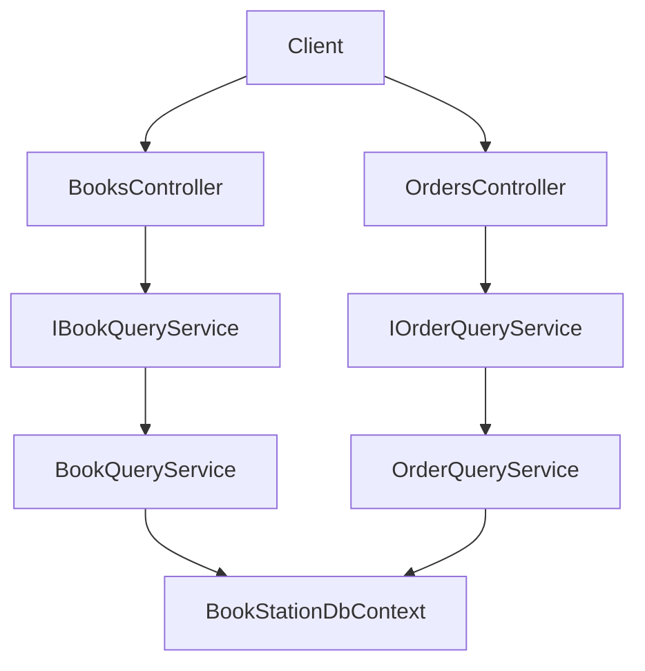

## Query patterns: DTO vs Projection (Book & Order)

### 1. Luồng kiến trúc



- Controller chỉ gọi query service và trả về DTO.
- Query service quyết định dùng kiểu **DTO-style** (load entity + map) hay **Projection-style** (Select trực tiếp trong DB).

### 2. Book queries

#### 2.1 Get all (DTO-style) – load entity + map

```csharp
public async Task<IReadOnlyList<BookListDto>> GetAllDtoAsync(CancellationToken cancellationToken)
{
    var entities = await _dbContext.Books
        .AsNoTracking()
        .Include(b => b.Publisher)
        .ToListAsync(cancellationToken);

    return entities
        .OrderBy(b => b.Title)
        .Select(b => new BookListDto(
            b.Id,
            b.Title,
            b.Language,
            b.PublishYear))
        .ToList();
}
```

#### 2.2 Get all (Projection-style) – Select trực tiếp

```csharp
public async Task<IReadOnlyList<BookListDto>> GetAllProjectionAsync(CancellationToken cancellationToken)
{
    var query = _dbContext.Books
        .AsNoTracking();

    return await query
        .OrderBy(b => b.Title)
        .Select(b => new BookListDto(
            b.Id,
            b.Title,
            b.Language,
            b.PublishYear))
        .ToListAsync(cancellationToken);
}
```

#### 2.3 GetById (Projection-style)

```csharp
public async Task<BookDetailDto?> GetByIdProjectionAsync(long id, CancellationToken cancellationToken)
{
    return await _dbContext.Books
        .AsNoTracking()
        .Where(b => b.Id == id)
        .Select(b => new BookDetailDto(
            b.Id,
            b.Title,
            b.Description,
            b.Language,
            b.PublishYear,
            b.PublisherId,
            b.Publisher != null ? b.Publisher.Name : null,
            b.CoverImageUrl,
            b.PageCount))
        .FirstOrDefaultAsync(cancellationToken);
}
```

#### 2.4 Pagination cho Book (Projection-style)

```csharp
public async Task<PagedResult<BookListDto>> GetPagedProjectionAsync(
    string? search,
    int page,
    int pageSize,
    CancellationToken cancellationToken)
{
    if (page <= 0) page = 1;
    if (pageSize <= 0) pageSize = 20;

    var query = _dbContext.Books
        .AsNoTracking()
        .AsQueryable();

    if (!string.IsNullOrWhiteSpace(search))
    {
        query = query.Where(b => b.Title.Contains(search));
    }

    var totalCount = await query.CountAsync(cancellationToken);

    var items = await query
        .OrderBy(b => b.Title)
        .Skip((page - 1) * pageSize)
        .Take(pageSize)
        .Select(b => new BookListDto(
            b.Id,
            b.Title,
            b.Language,
            b.PublishYear))
        .ToListAsync(cancellationToken);

    return new PagedResult<BookListDto>(items, totalCount, page, pageSize);
}
```

### 3. Order queries

#### 3.1 Get all Orders (DTO-style)

```csharp
public async Task<IReadOnlyList<OrderListDto>> GetAllDtoAsync(CancellationToken cancellationToken)
{
    var entities = await _dbContext.Orders
        .AsNoTracking()
        .Include(o => o.Payments)
        .ToListAsync(cancellationToken);

    return entities
        .OrderByDescending(o => o.CreatedAt)
        .Select(MapToOrderListDto)
        .ToList();
}
```

#### 3.2 Get all Orders (Projection-style)

```csharp
public async Task<IReadOnlyList<OrderListDto>> GetAllProjectionAsync(CancellationToken cancellationToken)
{
    var query = _dbContext.Orders
        .AsNoTracking();

    return await query
        .OrderByDescending(o => o.CreatedAt)
        .Select(o => new OrderListDto(
            o.Id,
            o.UserId,
            o.Status,
            o.TotalAmount.Amount,
            o.DiscountAmount.Amount,
            o.FinalAmount.Amount,
            o.ItemCount))
        .ToListAsync(cancellationToken);
}
```

#### 3.3 GetById Order (Projection-style với Items)

```csharp
public async Task<OrderDetailDto?> GetByIdProjectionAsync(long id, CancellationToken cancellationToken)
{
    return await _dbContext.Orders
        .AsNoTracking()
        .Where(o => o.Id == id)
        .Select(o => new OrderDetailDto(
            o.Id,
            o.UserId,
            o.Status,
            o.TotalAmount.Amount,
            o.DiscountAmount.Amount,
            o.FinalAmount.Amount,
            o.ShippingAddress.Street,
            o.ShippingAddress.Ward,
            o.ShippingAddress.City,
            o.ShippingAddress.Country,
            o.ShippingAddress.PostalCode,
            o.Notes,
            o.ConfirmedAt,
            o.CompletedAt,
            o.CancelledAt,
            o.CancellationReason,
            o.Items
                .Select(i => new OrderItemDto(
                    i.Id,
                    i.BookVariantId,
                    i.BookTitle,
                    i.VariantName,
                    i.Quantity,
                    i.UnitPrice.Amount,
                    i.Subtotal.Amount))
                .ToList()))
        .FirstOrDefaultAsync(cancellationToken);
}
```

#### 3.4 Pagination cho Order (Projection-style)

```csharp
public async Task<PagedResult<OrderListDto>> GetPagedProjectionAsync(
    long? userId,
    int page,
    int pageSize,
    CancellationToken cancellationToken)
{
    if (page <= 0) page = 1;
    if (pageSize <= 0) pageSize = 20;

    var query = _dbContext.Orders
        .AsNoTracking()
        .AsQueryable();

    if (userId.HasValue)
    {
        query = query.Where(o => o.UserId == userId.Value);
    }

    var totalCount = await query.CountAsync(cancellationToken);

    var items = await query
        .OrderByDescending(o => o.CreatedAt)
        .Skip((page - 1) * pageSize)
        .Take(pageSize)
        .Select(o => new OrderListDto(
            o.Id,
            o.UserId,
            o.Status,
            o.TotalAmount.Amount,
            o.DiscountAmount.Amount,
            o.FinalAmount.Amount,
            o.ItemCount))
        .ToListAsync(cancellationToken);

    return new PagedResult<OrderListDto>(items, totalCount, page, pageSize);
}
```

### 4. Khi nào dùng DTO-style vs Projection-style

- **DTO-style (load entity + map):**
  - Dùng khi cần logic map phức tạp, tái sử dụng entity trong nhiều bước nghiệp vụ.
  - Đơn giản khi mới bắt đầu, dễ debug vì có full entity trong bộ nhớ.

- **Projection-style (Select trực tiếp):**
  - Dùng cho API read-only, list/pagination lớn để giảm cột và giảm dữ liệu trả về.
  - Ít coupling với domain, tránh tự động eager loading không cần thiết.

Tốt nhất là bắt đầu với Projection-style cho các API read-only (đặc biệt là list/paged), và giữ DTO-style cho các màn hình cần nhiều logic map hoặc tái sử dụng entity. 

